# Sparta Digital Showcase

A web application portfolio for displaying Sparta projects.

### How to run

To run the application locally, follow the steps below:

1. Clone/download the git repository.
2. In the termnial change directory to **project-2**
3. If bundler is not already installed, in the terminal run: **gem install bundler**
4. Use bundler to install the required gems, in the terminal run: **bundle**
5. Create the database for the current rails environment, in the terminal run: **rake db:create**
6. Perform migrations for the current environment, in the terminal run: **rake db:migrate**
7. Populate the database with initial data, in the terminal run: **rake db:seed**
8. Create a .env file in the main directory, and add your user/bucket information.
9. Launch the web server, in the terminal run: **rails s**
10. In your browser go to **localhost:3000**

### Using the product

The web application has 3 levels of access: visitors, users and administrators. 

Visitors are able to see all projects on the index/homepage, as well as click on individual projects to see further details. Projects can also be searched for by title, author or tags. On individual project pages, users are also able to click a button to share a project via twitter.

In order to create a new project on the application, a visitor must create an account, login and become a "user". Users still have the same options as visitors, but are also able to create new projects, as well as edit/delete their own live projects.

Administrators have full access to the web application. In addition to having the same privileges as users, admins are able to edit/delete any project regardless of whether or not they created it. Admins must also approve projects created by users, in order for the projects to go "live" and appear on the web application to non-admins.

### Technology used

The web application was built using Ruby with the Ruby on Rails web application framework as the server side languages, with PostgreSQL used for the database management system. On the client side, HTML5, CSS and Javascript were used in conjunction with the bootstrap framework.

Alongside the above languages, the following gems were also used in Ruby:

* **rails 5.1.4** - To enable the rails framework
* **pg 0.18** - To enable PostgreSQL
* **puma 3.7** - To use puma as the app server
* **sass-rails 5.0** - To use SCSS for stylesheets
* **uglifier 1.3.0** - Javascript asset compressor
* **coffee-rails 4.2** - To CoffeeScript for .coffee assets and views
* **turbolinks 5** - For navigation optimisation
* **jbuilder 2.5** - For building Build JSON APIs
* **devise** - Authentication Solution
* **bootstrap-sass 3.3.6** - To enable bootstrap framework in ruby
* **jquery-rails** - To enable jquery library
* **paperclip** - Image uploader
* **aws-sdk 2.3** - For storing images using AWS
* **dotenv-rails** - For security of AWS account credentials
* **redcarpet** - For Markdown processing
* **simple-form** - For layout/design of forms

### Approach

This project was tackled using the agile methodology. The following section outlines the various stages of the projects progression.

##### Scoping Session

The project began with a scoping session between the scrum team and the client, which established the product criteria and design. The client wished the design/aesthetics of the web application to match the design of the Sparta Global webiste as closely as possible.

Index Page Wireframe:
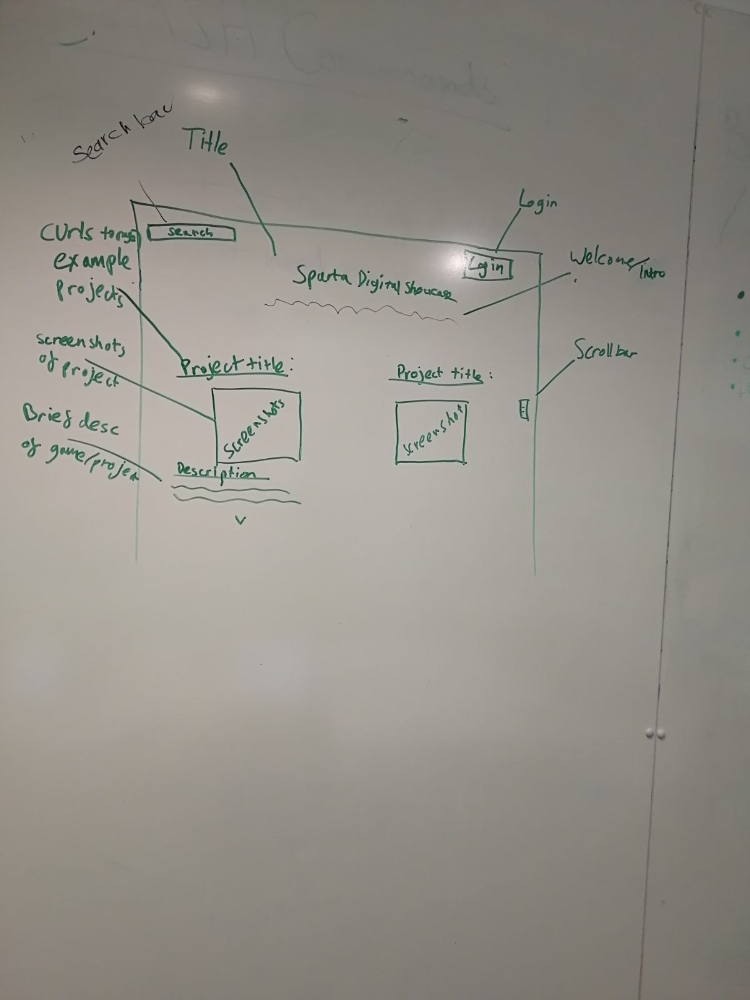

Show Page Wireframe:
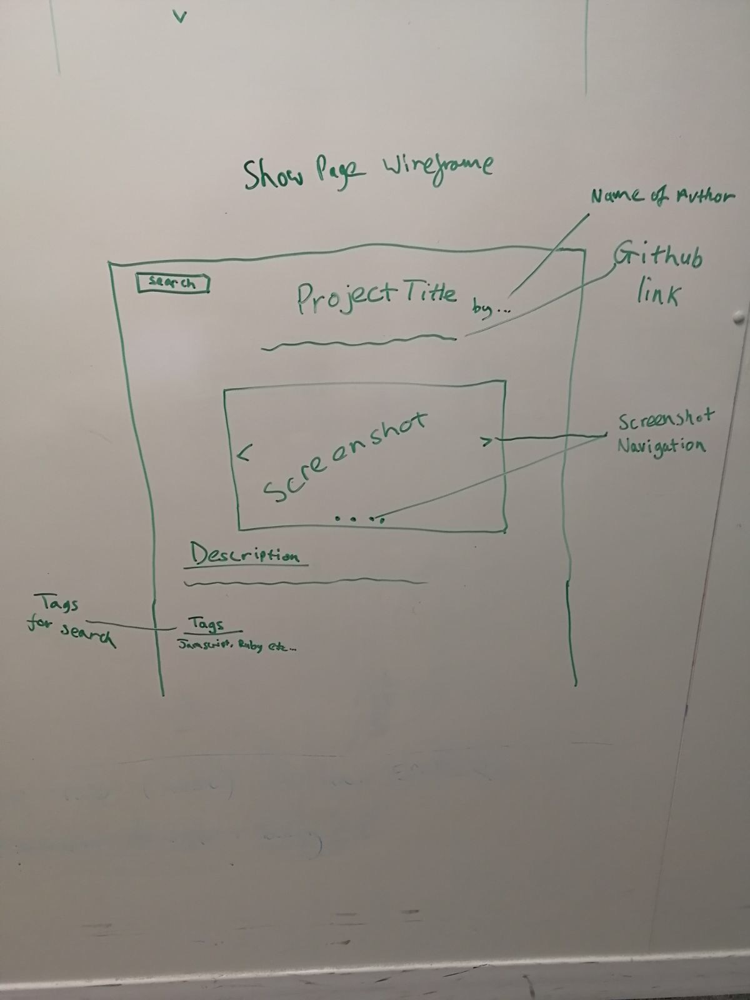

The base requirements were established as: 

* Database for storing project data.
* Login system.
* Restful routes for projects.
* Users can only edit/delete their own projects.
* Project images stored on AWS.

The following additonal features (in order of priority) were also established:

1. Administrator login, who must give approval in order for created projects to go live on site.
2. Search bar/ability to refine projects shown.
3. GitHub data (e.g. number of commits and other insight data) for a project to appear on its relevant show page.
4. Ability for users to write project desciption in markdown and have it rendered on the site.
5. Like feature, where users can "like" projects.
6. Ability to share project online.

It was established that the client would not be contactable during the development period, but the Product Owner had been fully briefed about the business requirements should there be any questions.

##### Release Planning

The project consisted of 2 sprints, approximately 3 days each. The end of the first sprint was set for Thursday at midday, and the end of the second sprint was set for Sunday at 5 o'clock. An MVP (minimum viable product) was needed by the end of sprint 1.

During the release planning, the indivual user stories were established and made, creating a product backlog. The user stories were also colour-coded based on the feature(s) they corresponded to. Green corresponded to MVP tasks, yellow for authorisation featues, pink for refinement, and blue for general additonal features. A physical and online task board was also created, with Trello used to make the latter. 

Inital Task Board:
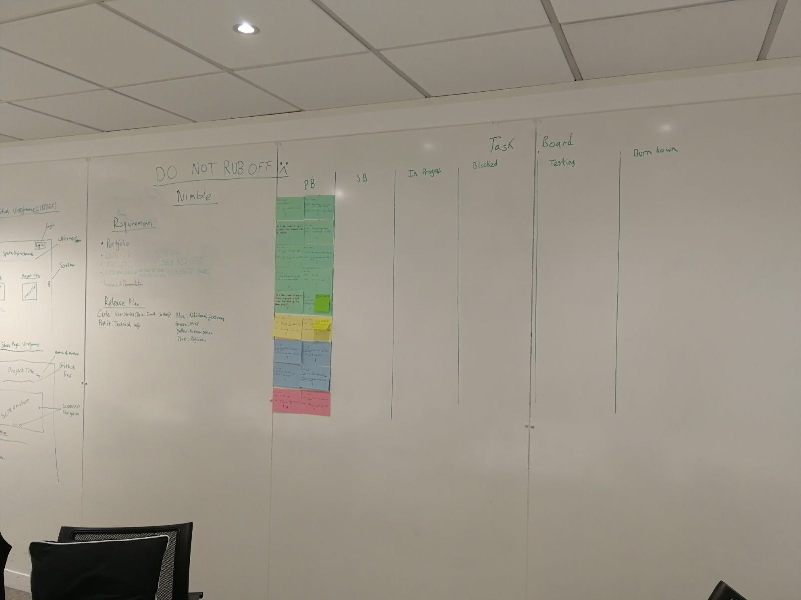

A comprehensive defintion of done for all tasks was also decided upon.

###### Definiton of Done:

* Passes acceptance criteria.
* Code runs without errors.
* Code has been peer reviewed.
* Code is clean & dry (e.g. indentation, whitespace).
* Code is commented where necessary.
* Changes have been documented.
* In-line with Sparta styling/aesthetics.
* Approved by product owner.
* Code has been implemented into development branch.

##### Sprint 1 Planning

During the sprint one planning session, the user stories were prioritsed and the sprint 1 backlog decided upon. The tasks needed for the MVP were put into the sprint backlog. The acceptance criteria for the sprint 1 user stories was then decided upon, and using the planning poker method, each story was assigned story points. Rough inital apporaches for each task were also discussed.

##### Sprint 1

During sprint one, the team began each day with a standup involving the developers, scrum master(s) and sometimes to product owner.

Task Board during Sprint 1:

At the end of Sprint 1, most of the MVP features had been completed, however the image hosting on AWS, styling and markdown features (which had been added during the sprint), were uncomplete and in-progress.

Task Board at end of  Sprint 1:
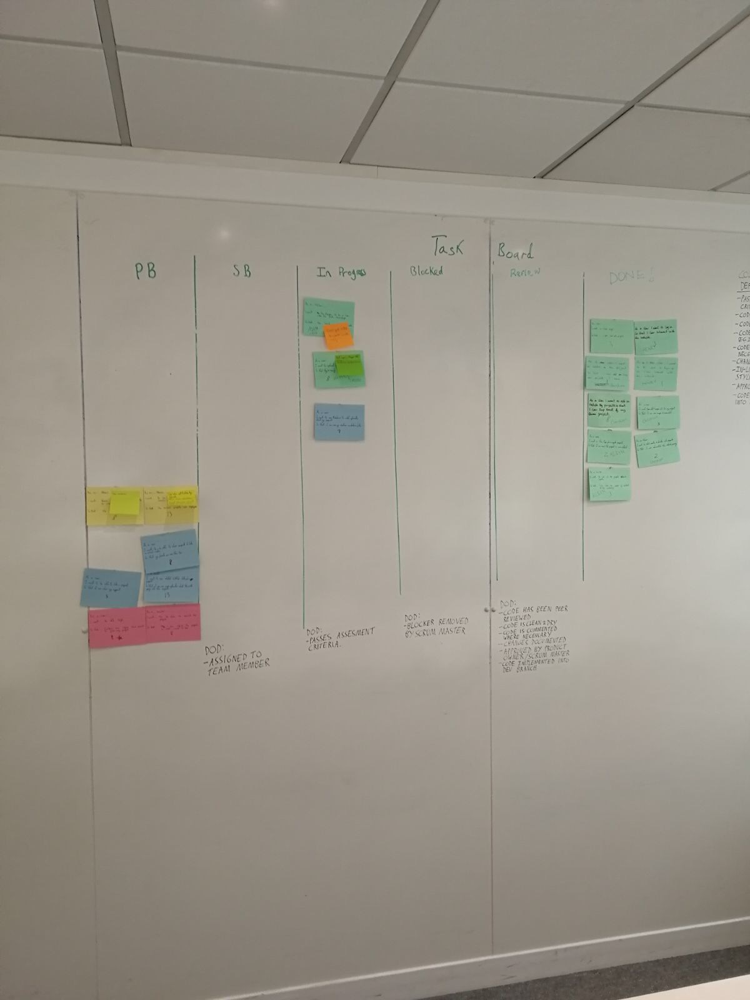

##### Sprint Review/Demonstration

At the end of sprint 1. The current product was demoed to the Product Owner. The product owner feedback was that the demo had gone on too long and should be more brief in future, as well as pointing out that some html and styling had been added for features which were not currently functional (namely the search bar and like button). A few bugs were also discovered which needed to be addressed in sprint 2 with high priority.

The bugs to address were:

* Hide Search Bar until functional.
* Ensure projects are all same size on index page:
    * Clip description.
    * Fix image size in CSS.
* Navbar size reduction on scrolling down cuts off login links.
* When there are validation errors on create/edit, footer doesn’t stay at bottom of page.

##### Sprint Retrospective

After the sprint review, the scrum team (minus the product owner) gathered together to discuss what they though had and hadn't gone well during sprint 1. To do this, the team used an emotional seismograph to show how they had been feeling during the sprint, as well as the "retrospective starfish" chart to discuss what the team had/hadn't done well and where to improve.

Emotional Seismograph:
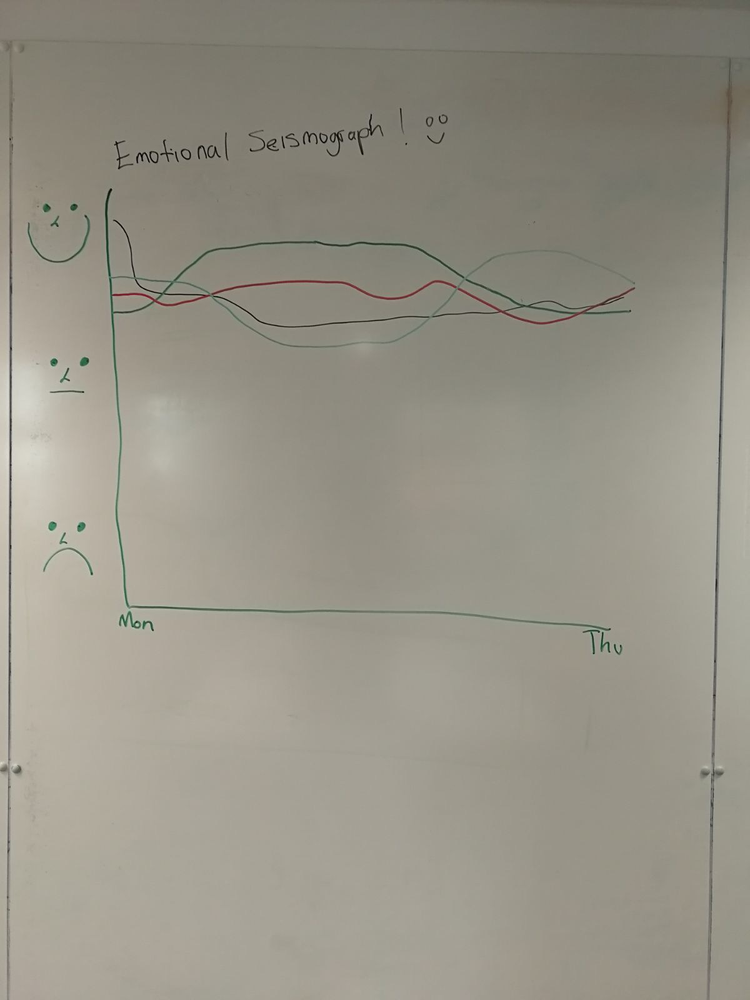

Retrospective Starfish:
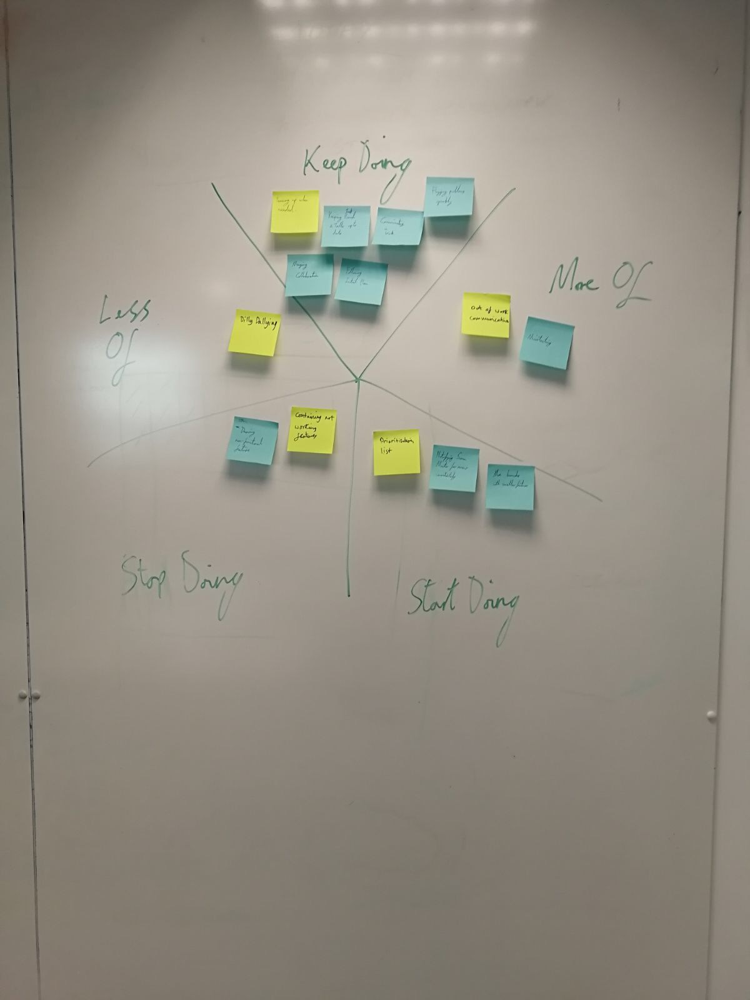

##### Sprint 2 Planning

During the sprint two planning session, additional user stories were created to address the identified bug fixes required. The user stories were re-prioritsed and the sprint 2 backlog decided upon, with some featues being put as stretch goals. Again, acceptance criteria was then decided upon and story points assigned.

Task Board at Start of Sprint 2:
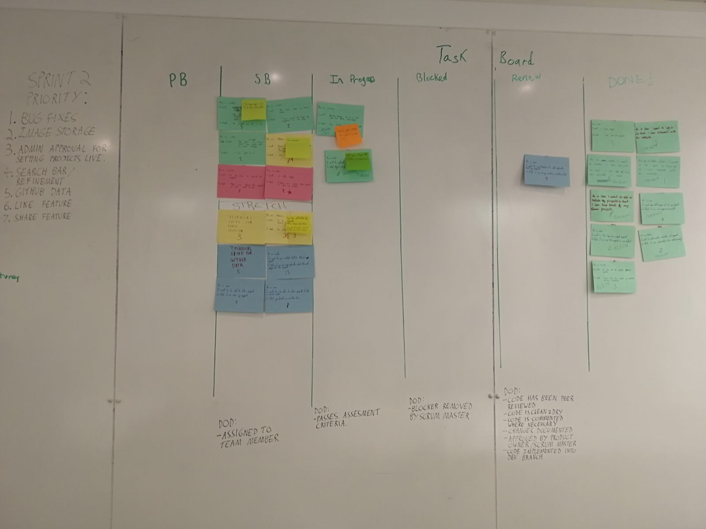

##### Sprint 2

Again, during sprint 2 there were daily standups in the morning.

Task Board during Sprint 2:
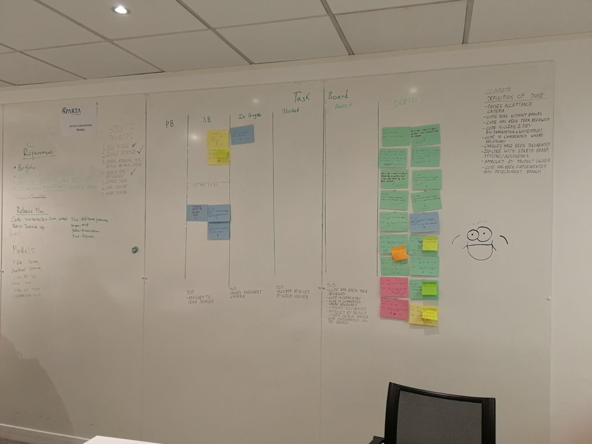

### Screenshots

(N.B All screenshots are taken from the perspective of an admin account.)

Index/Home Page:
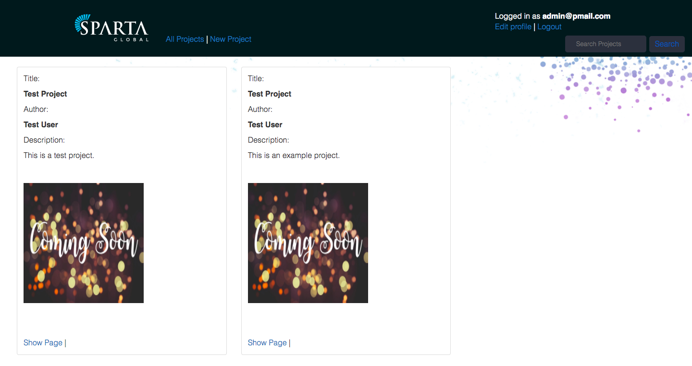

Show Page:
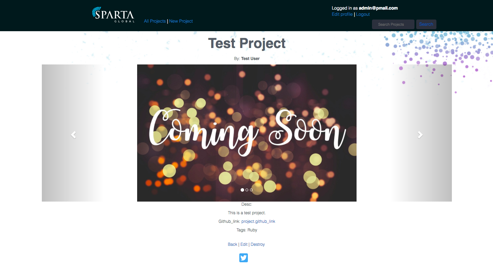

Create New Project Page:
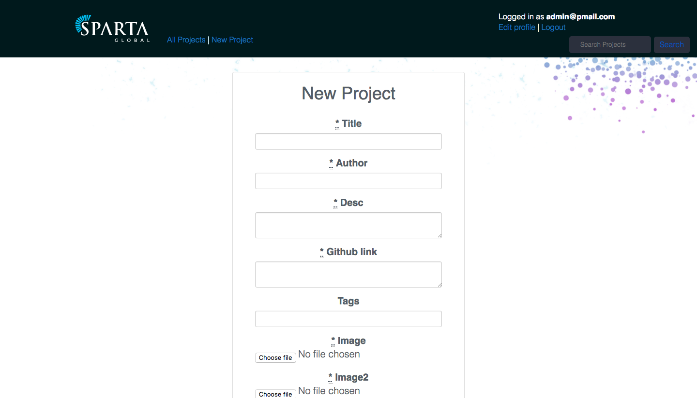

Edit Project Page:
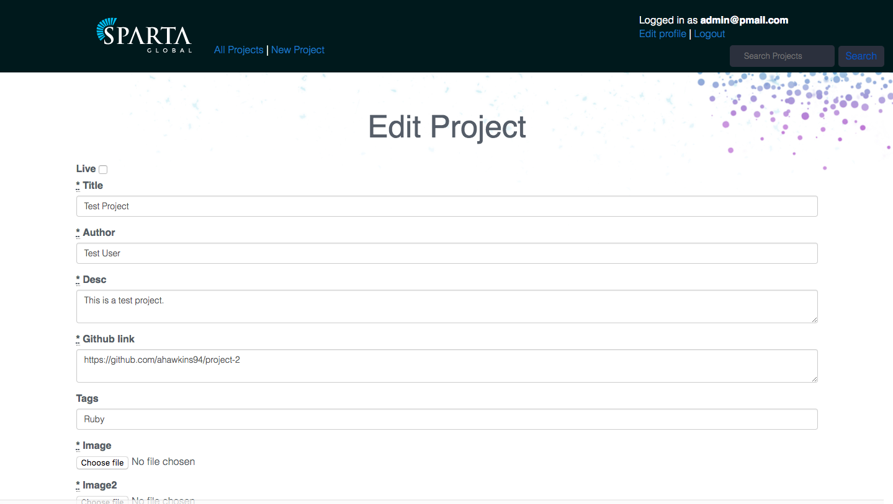